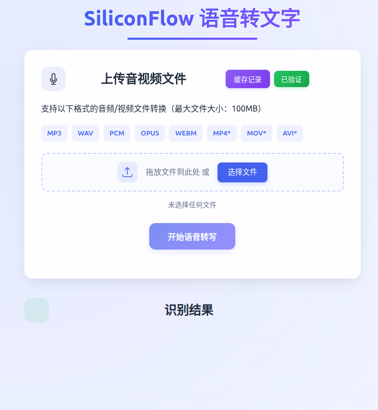
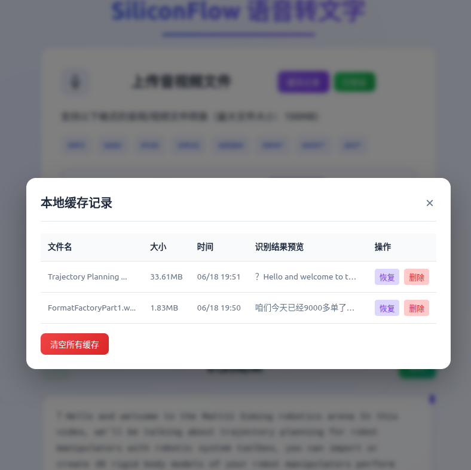
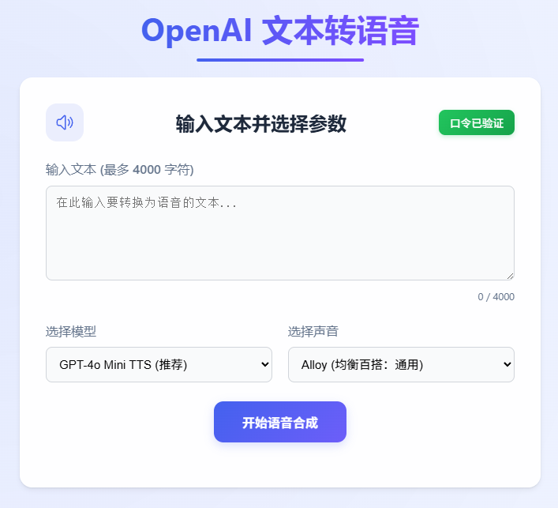

# VoiceHub 🎙️

## 项目简介 🚀
VoiceHub 是一个基于 Cloudflare Pages 的 AI 语音服务，集成了语音转文字（Speech-to-Text, STT）和文本转语音（Text-to-Speech, TTS）两大核心功能。用户可以通过简洁的前端页面轻松实现音视频文件的转写和文本的语音合成。

## 功能

### 通用功能
- 🔑 口令验证：通过统一的口令机制确保仅授权用户可以访问 STT 和 TTS 接口。
- 🔄 页面切换：在 STT 和 TTS 功能间方便切换。
- 🎨 统一美观的 UI：共享样式表，提供一致的用户体验。

### 🗣️ 语音转文字 (STT)
- 🗂️ 文件上传：支持拖拽或选择上传本地音频/视频文件
  - 支持音频格式：MP3, WAV, PCM, OPUS, WEBM 等。
  - 支持视频格式：MP4, MOV, AVI 等，浏览器将自动提取音轨进行处理。
  - 支持需要转换的音频格式：M4A, AAC, FLAC, OGG 等将由浏览器端尝试转换为WAV 以方便硅基 api 处理。
- 📋 结果展示与复制：清晰展示转写结果，并提供一键复制功能。
- ⚡ 本地结果缓存：已转写的文件将缓存于本地，避免重复调用接口，加快体验速度。

### 📝 文本转语音 (TTS)
- ⌨️ 文本输入：支持输入文本进行语音合成。
- 🤖 模型选择：提供多种 OpenAI TTS 模型选择。
- 🗣️ 声音选择：提供多种预设声音风格。
- 🎧 结果播放与下载：合成后的语音可在线播放，并提供下载。

## 目录结构
```
.
├── functions/
│   ├── auth.js 
│   ├── speech.js 
│   ├── transcribe.js 
│   └── verify.js 
├── public/
│   ├── index.html 
│   ├── tts.html 
│   └── style.css
├── wrangler.toml
└── README.md
```

### 环境变量

| 变量名称             | 描述                         | 示例值                                       | 类型                |
|----------------------|------------------------------------------------------|----------------------------|---------------------|
| `VERIFY_TOKENS`      | 客户端访问口令。用户在前端输入这些口令以获得访问权限。支持多个口令，用英文逗号 `,` 分隔。  | `"your_secret_password,another_token"`       | **必需**            |
| `SILICONFLOW_API_KEYS`| 用于 SiliconFlow STT (语音转文字) 服务的 API 密钥。支持多个密钥，用英文逗号 `,` 分隔。  | `"sk-sfkey1,sk-sfkey2"`                      | **必需** (用于 STT) |
| `AUTH_SECRET`        | 签名加密密钥，用于授权后续的 STT 和 TTS 请求。建议随机字符串。 | `"a_very_strong_and_random_secret_string"`   | **必需**            |
| `TTS_API_KEYS`       | TTS API 密钥 (例如 OpenAI API Key)。支持多个密钥，用英文逗号 `,` 分隔。   | `"sk-oaikkey1,sk-oaikkey2"`                  | **必需** (用于 TTS) |
| `TTS_ENDPOINT`       | (可选) TTS 服务的自定义 API 端点。如果未设置，后端将默认使用 OpenAI 的标准 TTS API 端点 (`https://api.openai.com/v1/audio/speech`)。 | `"https://your-custom-tts-api.com/v1/speech"`| 可选                |

## 部署 🛠️

本项目使用 Cloudflare Pages 托管静态资源，并可选配合 Pages Functions。以下为两种常见的部署方式。

1. 使用 Wrangler CLI 部署
  - 已安装 Node.js 和 npm  (若已安装可跳过)
  - 已安装并登录 Wrangler CLI：  
    ```bash
    npm install -g wrangler
    wrangler login
    ```
  - 注入环境变量 (项目名称可修改)
    ```bash
    wrangler pages secret put VERIFY_TOKENS --project-name voicehub
    wrangler pages secret put AUTH_SECRET --project-name voicehub
    wrangler pages secret put SILICONFLOW_API_KEYS --project-name voicehub
    wrangler pages secret put TTS_API_KEYS --project-name voicehub
    wrangler pages secret put TTS_ENDPOINT --project-name voicehub （可选）
    ```
  - 执行部署
    ```bash
    wrangler pages deploy public --project-name voicehub
    ```
2. 通过 Dashboard + Git 集成部署
  - 登录 Cloudflare → Pages → 选择本项目 → Settings → Git integration，关联你的 GitHub/GitLab/Bitbucket 仓库。
  - 在 Build settings 中设置：
    - **Build output directory**：public
  - 在 Environment variables & secrets （**变量与机密**）页面，分别新增：
    - 口令变量 Key: VERIFY_TOKENS
    - 签名加密字符串:  AUTH_SECRET
    - 硅基密钥 Key: SILICONFLOW_API_KEYS
    - TTS 密钥 Key: TTS_API_KEYS
    - TTS 端点（可选）：TTS_ENDPOINT
  - Push 代码到配置的分支，Pages 会自动拉取、构建并部署。

## 使用截图 📸




